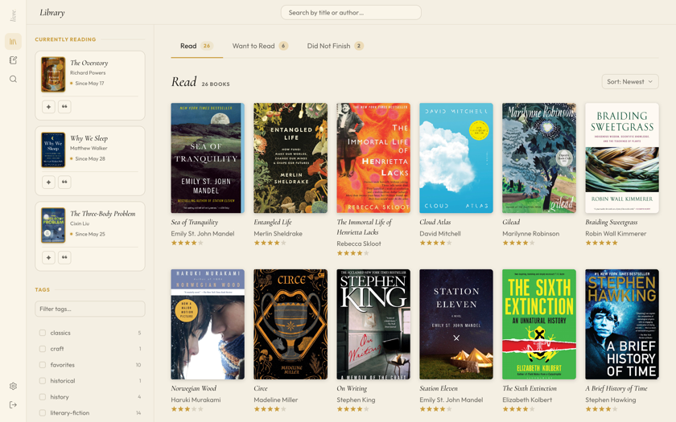
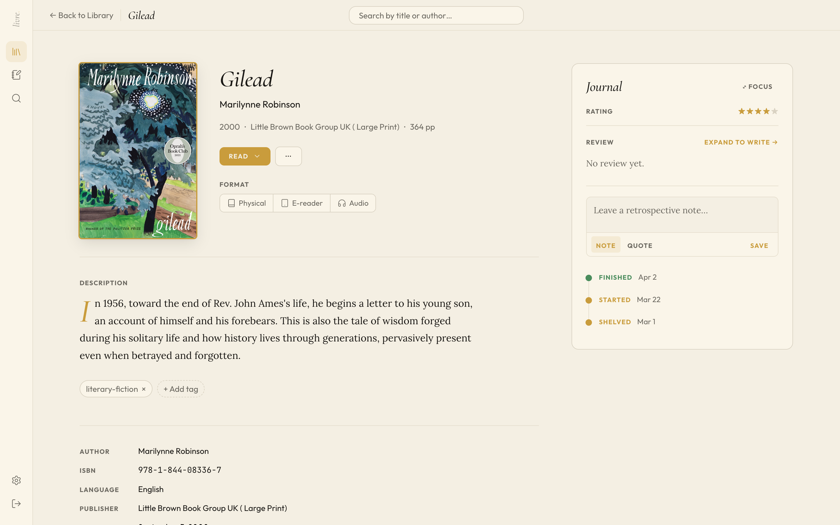
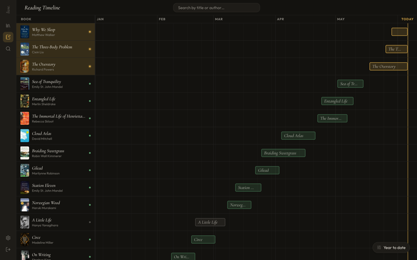
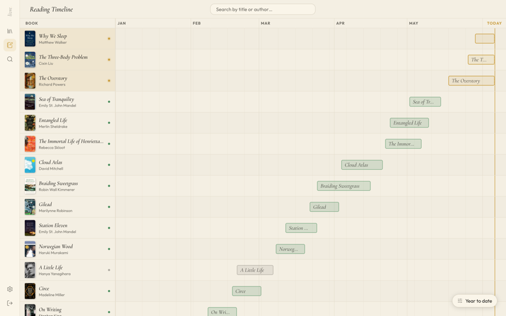

<!-- HERO -->
<div align="center">

# Livre

<!-- TODO: tagline (prose) -->

_Your bookshelf, self-hosted._

<!-- TODO: hero GIF — browse → open a book → log a session, demo library, dark theme -->
<!--  -->

<!-- BADGES -->

[](LICENSE)


</div>

<!-- SHORT PITCH -->
<!-- TODO: 2–3 sentence pitch (prose) — what Livre is, who self-hosts it, why -->

## Privacy

**Livre** maintains that you are the sole arbiter of how your reading experiences should be shared: you are their owner; nobody else. Of course, being self-hosted, Livre's data lives on your machine, or a trusted friend's :)

## Openness

Though restrictive by default, **Livre** provides its readers with frictionless, opt-in methods to share their records, if they choose. (With **Livre**'s branded masthead's of course—less of a way of achieving profitability as recruiting like-minded readers to the coilition).

## Simplicity

**Livre** is a reading tracker, that's all. What it does, it does elegantly and without unnecessary complication. Wherever possible, **Livre** aims to simplify your reading; life is complicated enough as it is.

## Gallery

A look at the demo library, in both themes.

<table>
  <tr>
    <th>Dark</th>
    <th>Light</th>
  </tr>
  <tr>
    <td></td>
    <td></td>
  </tr>
  <tr>
    <td></td>
    <td></td>
  </tr>
  <tr>
    <td></td>
    <td></td>
  </tr>
</table>

## Features

<!-- TODO: tighten copy (prose); bullets reflect what ships -->

- **Shelves** — want to read, reading, read, did-not-finish; status derived from your reading log
- **Ratings & reviews** — rate and review in your own private copy of each book
- **Reading timeline** — track reading sessions across cycles
- **Book search** — Open Library by default, Google Books when configured
- **Goodreads import / export** — bring your library in, take it out anytime (CSV)
- **Light & dark themes**
- **Demo mode** — explore a fully seeded library without entering any data of your own

## Quick start (Docker)

The fastest way to run Livre. Requires Docker.

```bash
docker compose up -d
```

Then open <http://localhost:3000>.

That's it — a session secret is generated and persisted to the `livre_data` volume on first run, and your library lives in that same volume. To pin a specific secret (e.g. across multiple instances), set `JWT_SECRET` in the environment or a `.env` file before starting.

## Manual setup (development)

Requires **Node 20 LTS** (`better-sqlite3` uses native APIs removed in newer Node).

```bash
nvm use 20
npm install            # installs all workspaces

cp .env.example .env   # optional — sensible defaults work out of the box
npm run dev            # types watcher + client (:5173) + server (:3001)
```

Then open <http://localhost:5173>. The Vite dev server proxies `/api` to the backend on `:3001`.

## Configuration

All configuration is via environment variables, validated at startup. None are required.

| Variable     | Default       | Description                                                                                                                               |
| ------------ | ------------- | ----------------------------------------------------------------------------------------------------------------------------------------- |
| `JWT_SECRET` | _auto_        | Secret for signing session tokens. If unset, one is generated and persisted to `DATA_DIR/.jwt_secret` (min 32 chars when set explicitly). |
| `DATA_DIR`   | `./data`      | Directory for the SQLite database and the generated secret. Docker uses `/data` (a mounted volume).                                       |
| `PORT`       | `3001`        | Server port. The Docker image defaults to `3000`.                                                                                         |
| `NODE_ENV`   | `development` | `development` · `production` · `test`.                                                                                                    |

## First run

<!-- TODO: prose around the steps -->

Livre has no accounts system and no cloud — the **first account you create on your instance is yours**, and it lives only in your database.

1. Open the app and create your account.
2. Start adding books via search, or import an existing library.

### Importing from Goodreads

<!-- TODO: confirm exact Settings path/labels against the running app before finalizing -->

1. In Goodreads, export your library to CSV (My Books → Import/Export → Export Library).
2. In Livre, open Settings → Import and upload the CSV.
<!-- TODO: screenshot of import dialog (light + dark) -->

## Demo mode

Want to see Livre with a real library before adding your own? Open **Settings → Demo → Enter demo mode** for an isolated, pre-seeded sandbox — shelves, ratings, reviews, and reading timelines across a curated set of books. Leaving demo mode returns you to your own data untouched.

## Tech stack

- **Client** — React 19, Vite, TypeScript, styled-components
- **Server** — Node.js (Express), TypeScript
- **Database** — SQLite via better-sqlite3, Drizzle ORM
- **API** — ts-rest contracts shared between client and server (Zod)
- **Monorepo** — npm workspaces (`client`, `server`, `shared`, `fe-libs/*`)

## Status

**Alpha.** Livre is usable and self-hostable today, but the schema and APIs may still change between releases.

<!-- TODO: roadmap bullets (prose) — what works, what's rough, what's next -->

## Contributing

Contributions are welcome. See [CLAUDE.md](CLAUDE.md) for architecture and conventions.

```bash
npm run lint           # eslint
npm run format         # prettier --write
npm test -w server     # vitest (server unit tests)
npm run build          # production build (types + client)
```

## License

[MIT](LICENSE)
