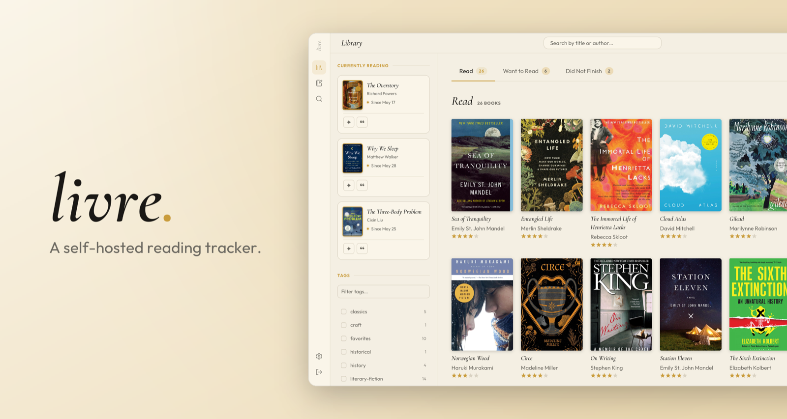

# Livre

[](LICENSE)


<picture>
  <source media="(prefers-color-scheme: dark)" srcset="docs/media/hero_roman_dark.png" />
  
</picture>

## About Livre

Livre is a self-hosted application for managing your digital bookshelf featuring metadata pulling, total editability, and a feature-rich reading timeline.

### Feature Breakdown

- **Shelves** — want to read, reading, read, did-not-finish; status derived from your reading log
- **Ratings & reviews** — rate and review in your own private copy of each book; add notes, quotes, and custom tags
- **Reading timeline** — view reading progress in a gantt-style timeline
- **Book search** — Open Library by default, Google Books when configured, other sources once built ;)
- **Goodreads import / export** — bring your library in, exit anytime (CSV)

**📸 [See the screenshots →](docs/SCREENSHOTS.md)** — library, book detail, reading timeline, and search.

**📖 [Read the product philosophy →](docs/PHILOSOPHY.md)**.

## Quick start (Docker)

Drop this into a `docker-compose.yml`:

```yaml
services:
  livre:
    image: ghcr.io/greg-dav/livre:alpha
    ports:
      - '3000:3000'
    volumes:
      - livre_data:/data
    restart: unless-stopped

volumes:
  livre_data:
```

Then `docker compose up -d`. The app runs out of the box at <http://localhost:3000>.

## Manual setup (development)

Requires **Node 20 LTS** (`better-sqlite3` uses native APIs removed in newer Node).

```bash
nvm use 20
npm install
npm run dev
```

Then open <http://localhost:5173>. The Vite dev server proxies `/api` to the backend on `:3001`.

## Tech stack

- **Client** — React 19, Vite, TypeScript, styled-components
- **Server** — Node.js (Express), TypeScript
- **Database** — SQLite via better-sqlite3, Drizzle ORM
- **API** — ts-rest contracts shared between client and server (Zod)
- **Monorepo** — npm workspaces (`client`, `server`, `shared`, `fe-libs/*`)

## Status

**Alpha.** Livre is usable and self-hostable today, but the schema and APIs may still change between releases.

Where it's headed — custom lists & collections, reading insights over the log, and integrations (KOReader, Calibre). See the full **[roadmap →](docs/ROADMAP.md)**.

## Contributing

Contributions are welcome. I need to get around to writing some actual contribution docs, but in the meantime feel free to check out [CLAUDE.md](CLAUDE.md) for architecture and conventions.

## License

[MIT](LICENSE)
