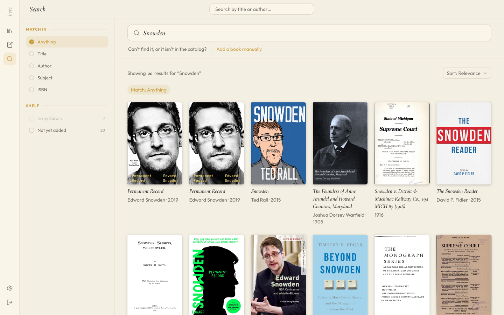

# Screenshots

A tour of Livre, shown with the demo library. Each shot matches your GitHub theme — light or dark.

> Want to poke at it yourself? Open **Settings → Demo → Enter demo mode** in a running instance for this exact library.

## Library

Browse your shelves — currently reading, and your books grouped by status.

  <picture>
    <source media="(prefers-color-scheme: dark)" srcset="media/library_roman_dark.png" />
    
  </picture>

## Book detail

Rate, review, and keep a private reading journal for each book.

  <picture>
    <source media="(prefers-color-scheme: dark)" srcset="media/book_detail_roman_dark.png" />
    
  </picture>

## Reading timeline

See your reading sessions laid out across the year.

  <picture>
    <source media="(prefers-color-scheme: dark)" srcset="media/log_roman_dark.png" />
    
  </picture>

## Search

Find books and add them to your shelves.

  <picture>
    <source media="(prefers-color-scheme: dark)" srcset="media/search_roman_dark.png" />
    
  </picture>

---

[← Back to the README](../README.md)
